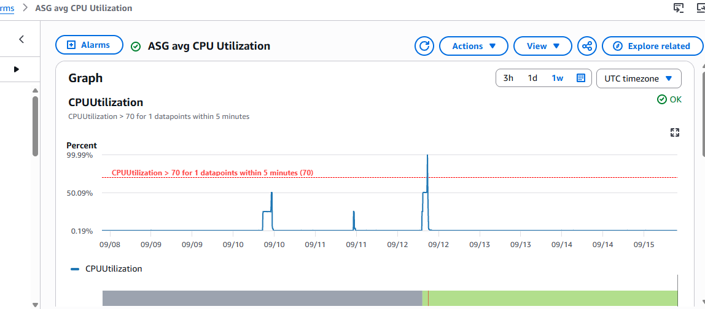
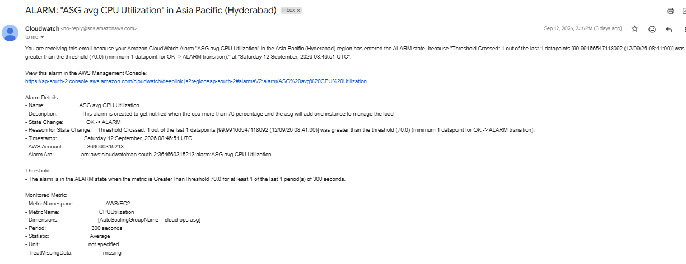
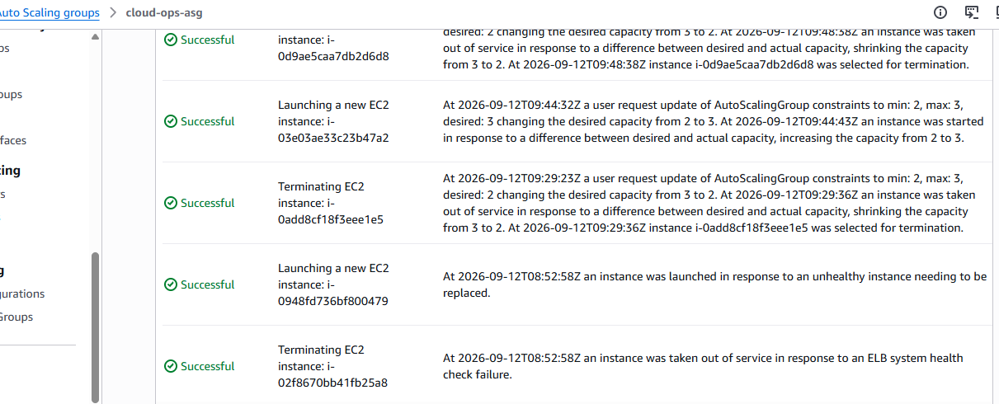
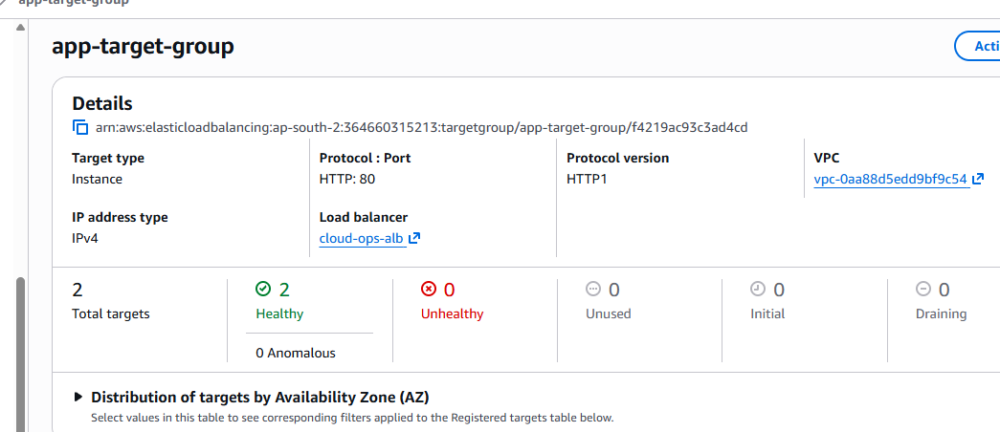
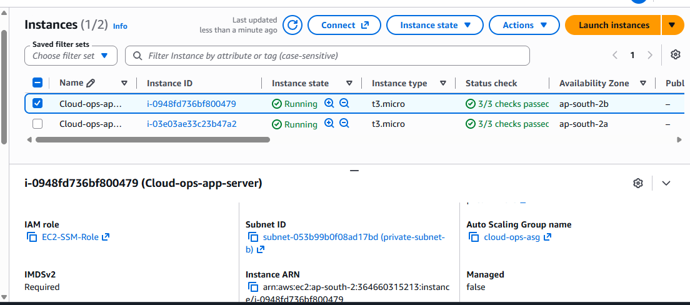
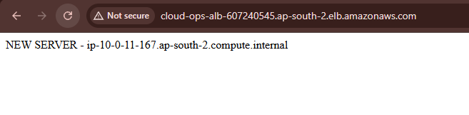

# AWS Cloud Operations & Auto Scaling Lab

## 📌 Overview

A hands-on AWS Cloud Operations project designed to simulate a production-style web application environment with **high availability, monitoring, automated scaling, alerting, and operational troubleshooting**.

The project demonstrates how AWS services can work together to automatically detect high CPU utilization, scale EC2 infrastructure, notify operations teams, and continue serving application traffic through an Application Load Balancer.

---

## 🏗️ Architecture

```text
                    Internet
                       │
                       ▼
              Application Load
                 Balancer (ALB)
                       │
                 Target Group
                       │
             ┌─────────┴─────────┐
             ▼                   ▼
          EC2 #1              EC2 #2
             │                   │
             └─────────┬─────────┘
                       │
                 Auto Scaling
                    Group
                       │
                 Scale Out
                       │
                    EC2 #3

Monitoring & Operations:

CloudWatch
     │
     ├── CPU Alarm
     │
     ├── SNS Notification
     │
     └── Auto Scaling Action

AWS Systems Manager (SSM)
     │
     └── Secure EC2 troubleshooting access
```

---

## 🎯 Project Objective

Build and validate an AWS environment that can:

* Distribute application traffic using an **Application Load Balancer**
* Maintain EC2 capacity using an **Auto Scaling Group**
* Monitor CPU utilization using **Amazon CloudWatch**
* Automatically scale out when CPU exceeds **70%**
* Send operational alerts using **Amazon SNS**
* Provide secure instance access using **AWS Systems Manager Session Manager**
* Validate that newly launched instances receive live application traffic

---

## ☁️ AWS Services Used

| Service                   | Purpose                           |
| ------------------------- | --------------------------------- |
| Amazon EC2                | Application servers               |
| Application Load Balancer | Traffic distribution              |
| Target Group              | EC2 health monitoring and routing |
| Auto Scaling Group        | Automated instance management     |
| Launch Template           | Standardized EC2 configuration    |
| Amazon CloudWatch         | Metrics and alarms                |
| Amazon SNS                | Alert notifications               |
| AWS Systems Manager       | Secure instance access            |
| AWS IAM                   | Access and instance permissions   |
| Amazon VPC                | Network infrastructure            |

---

## ⚙️ Implementation

### 1. High Availability

Configured EC2 instances across multiple Availability Zones using an Auto Scaling Group.

### 2. Load Balancing

Configured an Application Load Balancer with a Target Group to distribute HTTP traffic across healthy EC2 instances.

### 3. Automated Scaling

Configured an Auto Scaling Group with:

* Minimum capacity: **2**
* Desired capacity: **2**
* Maximum capacity: **3**

A CloudWatch CPU alarm triggers the scaling policy when average CPU utilization exceeds **70%**.

### 4. Monitoring & Alerting

Configured CloudWatch to monitor CPU utilization and Amazon SNS to send email notifications when the alarm enters the ALARM state.

### 5. Systems Manager

Configured an IAM instance profile with:

`AmazonSSMManagedInstanceCore`

This allowed EC2 instances to be accessed through Session Manager without relying on direct SSH access.

---

## 🧪 Testing & Validation

The environment was tested using a controlled CPU workload.

### Test Flow

```text
CPU Utilization > 70%
        ↓
CloudWatch Alarm
        ↓
SNS Notification
        ↓
Auto Scaling Policy
        ↓
New EC2 Instance Launched
        ↓
Target Group Health Check
        ↓
Instance Becomes Healthy
        ↓
ALB Routes Traffic
```

### Results

✅ CloudWatch CPU alarm triggered successfully

✅ SNS notification received

✅ Auto Scaling increased capacity from **2 → 3 instances**

✅ New EC2 instance launched automatically

✅ New instance registered with the Target Group

✅ Target Group reported healthy targets

✅ Session Manager access validated

✅ ALB traffic successfully reached the newly launched instance

---

## 📸 Project Evidence

### CloudWatch Alarm



### SNS Notification



### Auto Scaling Scale-Out



### Target Group Health



### Systems Manager / IAM



### ALB Traffic Validation



---

## 🛠️ Skills Demonstrated

* AWS Cloud Operations
* EC2 troubleshooting
* Application Load Balancing
* Auto Scaling
* CloudWatch monitoring
* SNS alerting
* IAM instance roles
* AWS Systems Manager
* Linux troubleshooting
* Application health monitoring
* Incident detection
* Operational validation
* High Availability concepts

---

## 📌 Key Learning

This project helped demonstrate a complete operational flow:

**Monitor → Detect → Alert → Scale → Validate → Troubleshoot**

The focus was not only on creating AWS resources, but also on validating how they behave during an operational event.

---

## ✅ Project Status

**Completed and Tested**

This project is part of my hands-on journey toward **Cloud Operations / Cloud Support / SRE / DevOps** roles.
